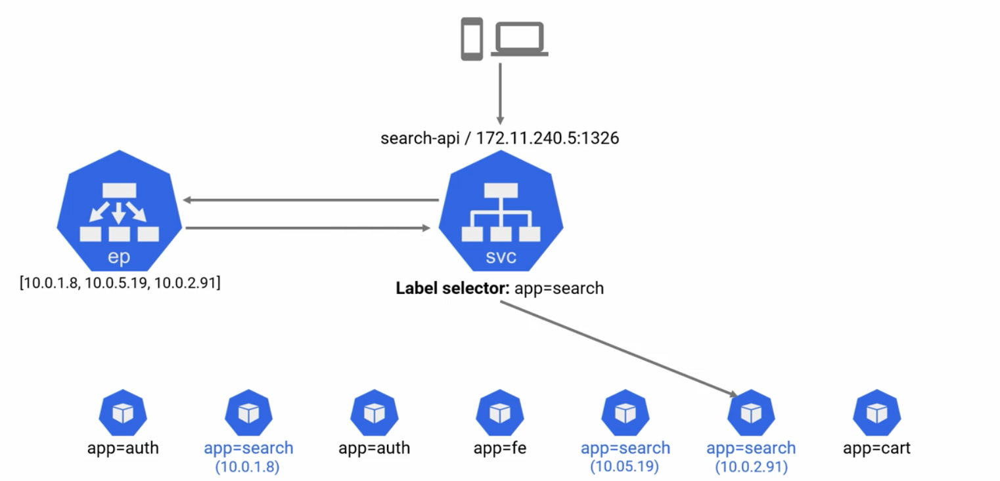

# A Cloud Guru Notes: Kubernetes Deep Dive Course

**Author:** Richard Hanna

The purpose of this document is to consolidate and highlight key notes from the lessons in the [**Kubernetes Deep Dive**](https://learn.acloud.guru/course/kubernetes-deep-dive/overview) Course on A Cloud Guru.

This markdown is broken down by chapters in the course, with subsections based on the lectures.

This is an admittedly scrawled series of notes, so please excuse any typos :sweat_smile:

**Symbol Key:**

- :bulb: = Key Point

## Kubernetes Big Picture

### Kubernetes Primer

- **Cloud-Native App**: lots of interactive services that come together to make a useful app
  - small, specialized components i.e. _containers_

Kubernetes clusters are made up of numerous Linux nodes, VMs, or cloud instances. Some exist in the **control plane** and others are **worker nodes**.

- **Control Plane**: brains of the cluster, where all the magic happens. Made up of:
  - API server
    - Gateway into the cluster, all requests to the cluster all go through here
      - `kubectl` commands go through here, i.e. POST requests
  - Scheduler
  - Controllers
  - Persistent Store: etcd (the only stateful component of the plane)
- **Worker Nodes**: where the apps run

### The Kubernetes API

Everything housed in Kubernetes is a resource defined in the API (pods, deployments, secerts, etc.). It is "RESTful" and use HTTPS to perform CRUD-style operations/verbs (**C**reate, **R**ead, **U**pdate, **D**elete).

Kubernetes is based on **Declarative Configuration**. App components are defined via YAML files, YAML files are posted to the API as a record of intent, and this updates the overall desired state of the cluster. Meanwhile, the control plane is constantly running services that check that the current observed state of the cluster matches the desired state. Those watch loops will notice when there is a mismatched and kick in the services to bring the current state up to speed with the desired state.

There are numerous API groups to break up the API monolith:

- core
- apps
- authorization
- storage

[**SIGs**](https://github.com/kubernetes/community/blob/master/sig-list.md) ("**S**pecial **I**nterest **G**roups")look after API groups. These are human beings responsible for feature development.

### Kubernetes Objects

**Containers** are run in Kubernetes by **pods**. Pods are the most atomic element of Kubernetes, but can contain multiple containers.

Pods are objects that exist on the **cluster**. Pods are wrapped into a **deployment**, also an object in the cluster. Both of these are defined in the `apps/v1` API group. Deployments are meant to make pods scalable, rollbacks and updates simple, etc.

**Daemon sets** (`ds`) make sure that one, and only one, of a specific podpod will run on ever worker in the cluster.

**Stateful sets** (`sts`) are for pods or parts of the app with stateful requirements.

## Application Architecture

### Theory

**Sample application theoretical setup:**

**Kubernetes sample app infrastructure:**

### Kubernetes Networking

### Common Networking Requirements

Prior to Kubernetes, apps used to be giant monoliths containing all their necessary services with a single IP address. Now, all of the services are separated out and have their own IP addresses, which are also their own **endpoints**. This requires a solid and dynamic DNS.

"Churn" = addition and removal of endpoints from the network when scaling happens. Highly dynamic networks are the new normal and so churn occurs constantly. This creates and changes IPs.

### Kubernetes Networking Basics

"House Rules:"

- All Nodes can talk
- All Pods can talk with each other without NAT
  - **pods are ephemeral**
- Every Pod gets its own IP address

The two networks to remember are **Nodes** and **Pods**.

A fundamental concept with pod networks is that once you are inside the network, all pods are free to talk to each other.

### Kubernetes Service Fundamentals

**Services** (`svc`) are the key ingredient for providing a stable abstraction point for pods. The service object logically exists in front of the pods, and tell objects like the Cart and Accounts to hit the Service instead of the pods directly.

Every Service gets a name and an IP. Created services are _stable_ and never change.

Every cluster has a native DNS service and every pod knows how to use it. This lets every pod be able to reach the service.

Kubernetes also creates objects on the cluster called **endpoints** which are responsible for informing the service about which pods are alive.

**Example Service diagram:**

### Service Types

The main spec types are `LoadBalancer`, `ClusterIP`, and `NodePort`.

`ClusterIP` is the default and most basic. Gives the service its own IP which is only reachable from inside the cluster.

`NodePort` gives the service a cluster-wide port and enables access outside the cluster.

`LoadBalancer` integrates with public cloud platform. You don't have to create the NodePort, Kubernetes handles it.

### Demo Notes

All demo notes use the 3 deployment YAML manifests found in `/lesson-network`.

> **You can SSH into a pod by using `kubectl exec -it <insert pod name>`**
