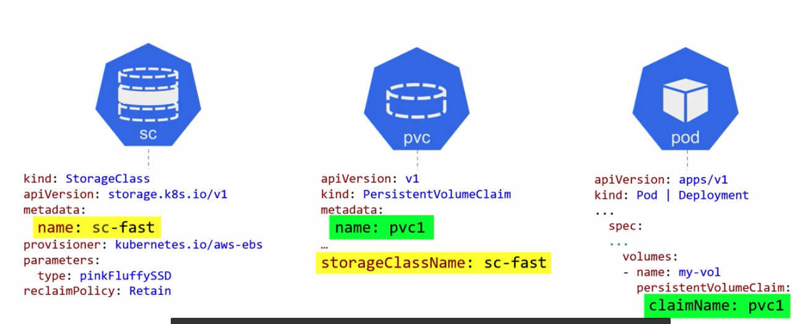
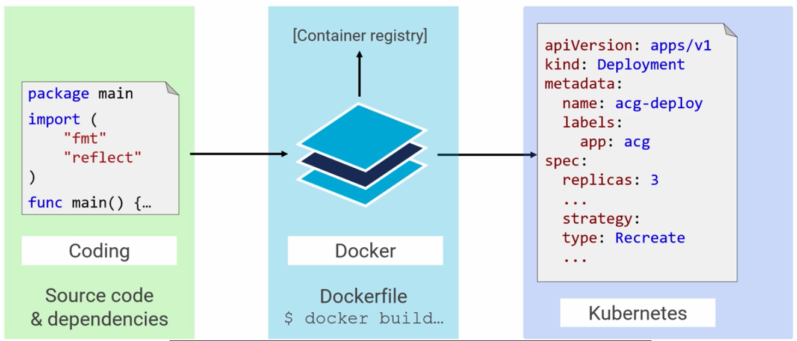
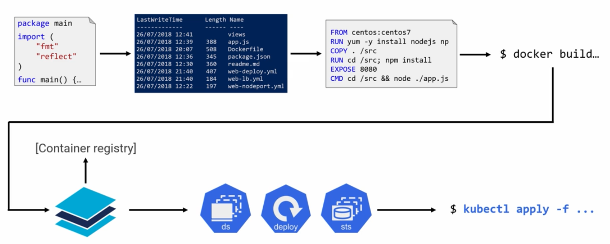
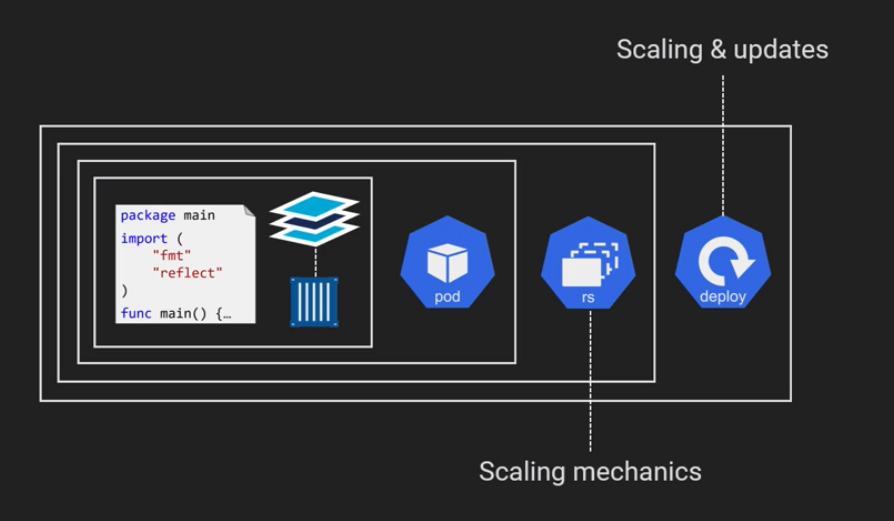
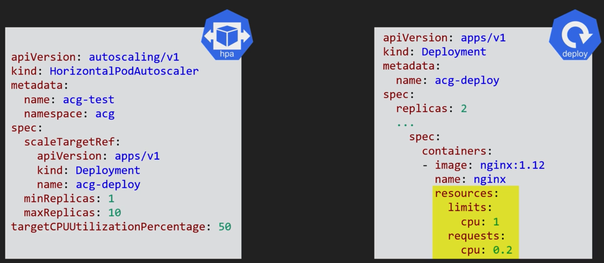
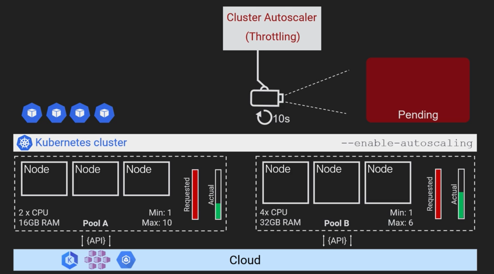

# A Cloud Guru Notes: Kubernetes Deep Dive Course

**Author:** Richard Hanna

The purpose of this document is to consolidate and highlight key notes from the lessons in the [**Kubernetes Deep Dive**](https://learn.acloud.guru/course/kubernetes-deep-dive/overview) Course on A Cloud Guru.

This markdown is broken down by chapters in the course, with subsections based on the lectures.

This is an admittedly scrawled series of notes, so please excuse any typos :sweat_smile:

**Symbol Key:**

- :bulb: = Key Point

## Kubernetes Big Picture

### Kubernetes Primer

- **Cloud-Native App**: lots of interactive services that come together to make a useful app
  - small, specialized components i.e. _containers_

Kubernetes clusters are made up of numerous Linux nodes, VMs, or cloud instances. Some exist in the **control plane** and others are **worker nodes**.

- **Control Plane**: brains of the cluster, where all the magic happens. Made up of:
  - API server
    - Gateway into the cluster, all requests to the cluster all go through here
      - `kubectl` commands go through here, i.e. POST requests
  - Scheduler
  - Controllers
  - Persistent Store: etcd (the only stateful component of the plane)
- **Worker Nodes**: where the apps run

### The Kubernetes API

Everything housed in Kubernetes is a resource defined in the API (pods, deployments, secerts, etc.). It is "RESTful" and use HTTPS to perform CRUD-style operations/verbs (**C**reate, **R**ead, **U**pdate, **D**elete).

Kubernetes is based on **Declarative Configuration**. App components are defined via YAML files, YAML files are posted to the API as a record of intent, and this updates the overall desired state of the cluster. Meanwhile, the control plane is constantly running services that check that the current observed state of the cluster matches the desired state. Those watch loops will notice when there is a mismatched and kick in the services to bring the current state up to speed with the desired state.


There are numerous API groups to break up the API monolith:

- core
- apps
- authorization
- storage

[**SIGs**](https://github.com/kubernetes/community/blob/master/sig-list.md) ("**S**pecial **I**nterest **G**roups")look after API groups. These are human beings responsible for feature development.

### Kubernetes Objects

**Containers** are run in Kubernetes by **pods**. Pods are the most atomic element of Kubernetes, but can contain multiple containers.

Pods are objects that exist on the **cluster**. Pods are wrapped into a **deployment**, also an object in the cluster. Both of these are defined in the `apps/v1` API group. Deployments are meant to make pods scalable, rollbacks and updates simple, etc.

**Daemon sets** (`ds`) make sure that one, and only one, of a specific podpod will run on ever worker in the cluster.

**Stateful sets** (`sts`) are for pods or parts of the app with stateful requirements.

## Application Architecture

### Theory

**Sample application theoretical setup:**


**Kubernetes sample app infrastructure:**


### Kubernetes Networking

### Common Networking Requirements

Prior to Kubernetes, apps used to be giant monoliths containing all their necessary services with a single IP address. Now, all of the services are separated out and have their own IP addresses, which are also their own **endpoints**. This requires a solid and dynamic DNS.

"Churn" = addition and removal of endpoints from the network when scaling happens. Highly dynamic networks are the new normal and so churn occurs constantly. This creates and changes IPs.

### Kubernetes Networking Basics

"House Rules:"

- All Nodes can talk
- All Pods can talk with each other without NAT
  - **pods are ephemeral**
- Every Pod gets its own IP address

The two networks to remember are **Nodes** and **Pods**.


A fundamental concept with pod networks is that once you are inside the network, all pods are free to talk to each other.

### Kubernetes Service Fundamentals

**Services** (`svc`) are the key ingredient for providing a stable abstraction point for pods. The service object logically exists in front of the pods, and tell objects like the Cart and Accounts to hit the Service instead of the pods directly.

Every Service gets a name and an IP. Created services are _stable_ and never change.

Every cluster has a native DNS service and every pod knows how to use it. This lets every pod be able to reach the service.

Kubernetes also creates objects on the cluster called **endpoints** which are responsible for informing the service about which pods are alive.

**Example Service diagram:**


### Service Types

The main spec types are `LoadBalancer`, `ClusterIP`, and `NodePort`.

`ClusterIP` is the default and most basic. Gives the service its own IP which is only reachable from inside the cluster.


`NodePort` gives the service a cluster-wide port and enables access outside the cluster.


`LoadBalancer` integrates with public cloud platform. You don't have to create the NodePort, Kubernetes handles it.


### Demo Notes

All demo notes use the 3 deployment YAML manifests found in `/lesson-network`.

> **You can SSH into a pod by using `kubectl exec -it <insert pod name>`**

### Kubernetes Storage

### Kubernetes Storage Big Picture

**Kubernetes Volumes** decouple storage from pods. Volumes exist on the cluster, pods lay claims to them and mount them. This way if a pod dies, the volume still persists. Volumes can be shared between multiple pods.

"File" and "Block" storage are standards based, have a pluggable back end, and a rich API.

In the image below is the storage system on the left (gives us storage features), the PV subsystem on the right (gives us means of consumption), and in the middle is the CSI (Container Storage Interface) connecting them.

- **PV**: Storage space
- **PVC**: Ticket for the application to use the PV
- **SC**: Makes this dynamic and scalable


### The Container Storage Interface

The [CSI](https://github.com/container-storage-interface) connects the storage system with the PV Kubernetes subsytem. This open source, open standard solution completely decouples Kubernetes from the source code. This allows developers to release updates on their own schedule without worry about having to make their code open source.

The CSI actually is not Kubernetes specific, allowing third party users to write their own plug-ins. However, for Kubernetes there is a preferred CSI plugin.


### Persistent Volumes and Persistent Volume Claims

A PV is a storage backend made available inside the Kubernetes cluster. In AWS, for example, this can be a HD or SSD with a specified size and Read/Write capability.

To use the PV, a pod needs a PV Claim (PVC). PVCs, like everything else, are resources in the API and objects in the cluster. In the diagram below we see the YAML files for a PV and PVC and so long as the yellow areas match then the two are combined:


You can retrieve information about PVs with:

`kubectl get pv`

### Storage Classes

> Storage classes enable dynamic provisioning of volumes.

You can have as many storage classes (`sc`) as you want, but each one relates to a particular storage backend by referencing a plug-in. In the YAML files, plug-ins are called `provisoner`s.

**Example storage class YAML declaration**:

```YAML
kind: StorageClass
apiVersion: storage.k8s.io/v1
metadata:
  name: sc-fast
provisoner: kubernetes.io/aws-ebs
parameters:
  type: gp2
reclaimPolicy: Retain
```

**Interaction and cross-referencing resources:**



As you can see above, the `metadata` `name` is important for referencing asset classes across each other.

## From Code to Kubernetes

### Big Picture

High level big picture interaction:


The basic gist is:
- Load your code and dependencies into a directory
- Write a Docker file telling Docker how to build it all into an image
- Push the image to registry (on prem or in a VPC)
- Roll into a Kubernetes deployment (see below)



### Recap



- Code (language of choice) with any dependencies
- Send to a directory
- Send to a Docker file to build a Docker image
- Put the image into a container for Kubernetes to reach (i.e. Docker Hub, cloud, etc.)
- Send to a deployment/daemon set/stateful set, wrap the container in one or more pods
- Finally run `kubectl apply -f ...` to run the code on the cluster

## Kubernetes Deployments

### Theory of Deployments

Up till now we understand that our source code basically gets fed into an image that gets sent to a container. Since Kubernetes doesn't like "naked" containers, the container is wrapped up in a pod.

Pods are wrapped into **deployments** in much the same way that pods wrap containers. Between the deployment and pods is a **replica set** which takes handling of scaling mechanics that deployments rely on. However, you rarely see or interact with replica sets, mostly just deployments.



Changes to the deployment should be done _declaratively_ directly in the `deployment.yml` file with version control.

> **Note**: It is better to update your deployment using the YAML file with `kubectl` than it is to undo a rollout with the `kubectl rollout undo` command.
> **Note:** Labels are what connects deployments to pods.

## Scaling Applications

### Big Picture

To automatically add more nodes there is the **Cluster Autoscaler** and to add more pods there's the **Horizontal Pod Autoscaler**.

The horizontal pod autoscaler basically takes the job of auto-configuring the `replicas: __` line from your deployment manifest file. It will auto increase or decrease the number of pods needed. Once the nodes containing those pods reach their capacity, the cluster autoscaler increases the number of nodes to take care of any pods listed as "pending."

### Horizontal Pod Autoscaler Theory

You define the `hpa` just like any othe resource and connect it to a deployment.

In the following example, `targetCPUUtilizationPercentage` dictates a pod CPU threshold for the `hpa` to maintain and the deployment uses `resources` requests to keep it:



In this example, `cpu: 0.2` is the same as saying "200 milicores" or "200m" where 1000m = 1CPU. So in this case, 1/5 or 20% of a CPU.

When CPU usage reaches the threshold based on the resource requests, a new pod will get triggered.

You can find information about your `hpa` using the command:

```bash
kubectl get hpa --namespace <namespace>
```

The `hpa` does not know how to scale or schedule pods, it just knows _when_ to do it. The "how" is taken care of by the deployment.

### Cluster Autoscaler Theory

This requires autoscaling enabled in your cloud-hosted K8s service. "Pools" of identically spec'd nodes are defined. Each node pool gets a max and min value for number of nodes it has.

Then you configure your deployment similarly. Cluster scaling **only works** if you configure your pods with resource requests. Schedule all of your pods with resource requests!

As the `hpa` scales and grows pods, if any of the pods wind up going to "pending" due to insufficient node resources, the cluster autoscaler will kick in and grow the cluster.

